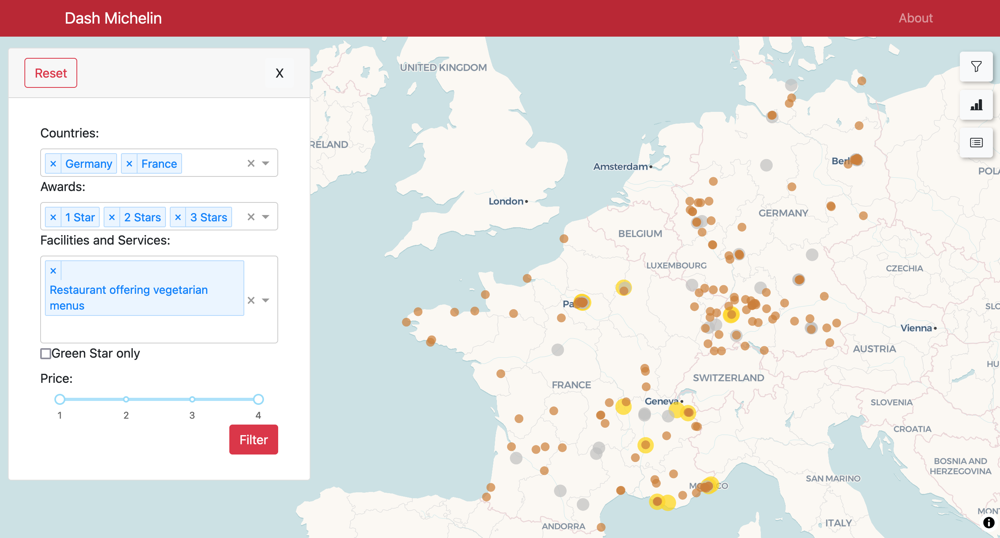
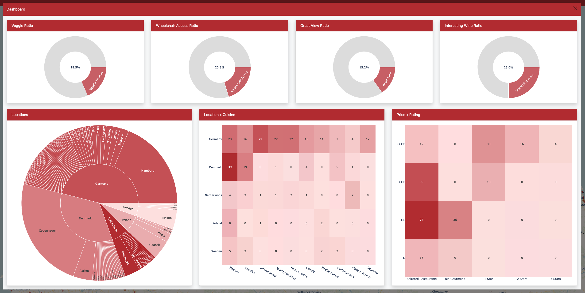

# dash-michelin

This project is our submission to the [Plotly Autumn App Challange](https://community.plotly.com/t/autumn-app-challenge/87373). The corresponding web app can be viewed [here](TBD).

## Key Features

The key focus of this web application is to allows users to dive into the world of Michelin star restaurants and to discover places based on their preferences and interest. To allow for that, we have implemented the following key features in the app.

### Overview
The map is the central component of this application. It displays all restaurants that are part of the guide michelin and allows the user to discover around the globe.

### Filters
Through the filters, users are enabled to customize the map along their preferences.

### Tooltips
By hovering over a restaurant, the user can easily get the most basic information about that place.

### Profile View
If users want to get more information than what they can get via the tooltips, the can simply click on the restaurant and view the restaurant profile box.

### Dashboard
If a user is interested in an entire area rather than a single restaurant, they can click on the dashboard button. As a result, a dashboard is shown based on all restaurants in view. The "Locations" chart as well as the "Location x Cuisine" chart adjust based on how many restaurants are in view.

### List
If the user prefers to scroll through the restaurants in view, they have the option to click on the restaurant list button. This gives them a paginated list with all restaurants in view, sorted by their number of Michelin stars. Additionally, clicking on a restaurant in that lists leads to that restaurant being focussed on the map.

## Contact
For feedback and notes, please reach out to [Felipe Forero Meola](https://www.linkedin.com/in/felipe-forero-meola/) or [Jan-Niklas Wolters](https://www.linkedin.com/in/jan-niklas-wolters-189333179/).

